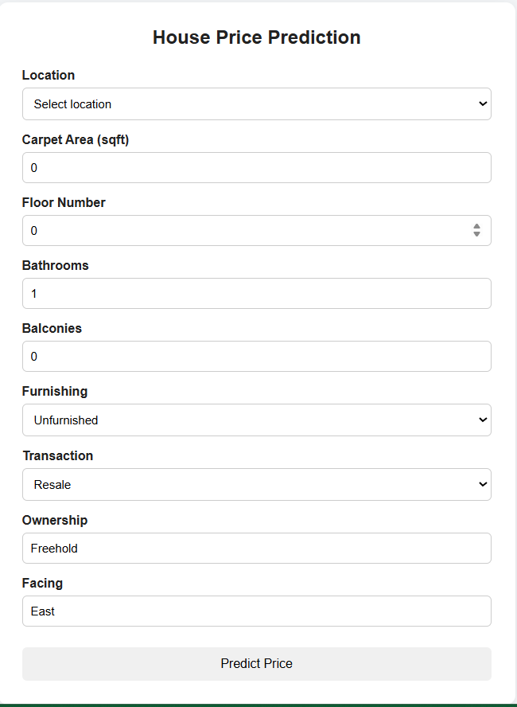
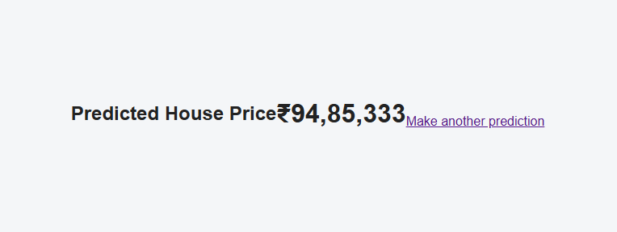
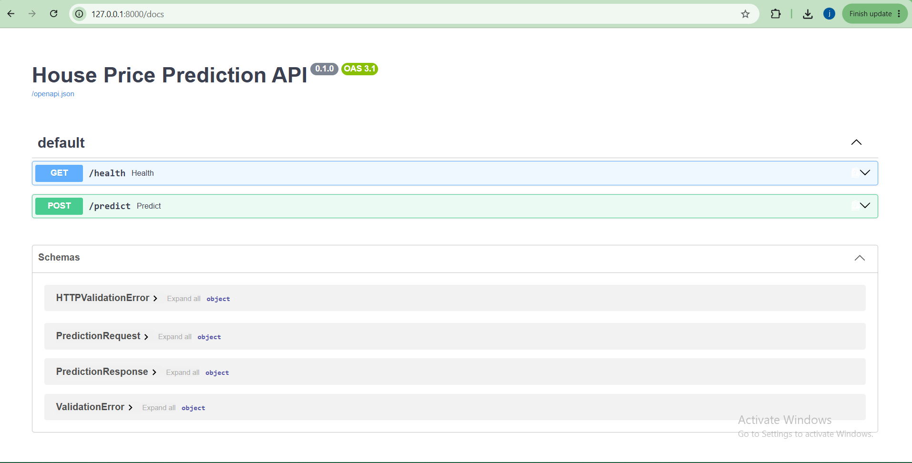

# House Price Prediction — End-to-End ML Web App


## Overview


This project is an end-to-end machine learning application for predicting house prices based on property information.


The project includes:


* Data exploration and cleaning using Pandas

* Exploratory Data Analysis (EDA)

* Feature engineering

* Regression model training and evaluation

* Model export using Joblib

* FastAPI backend for serving predictions

* React + TypeScript frontend

* End-to-end communication between the frontend, API, and machine learning model


The final selected model is a **Random Forest Regressor**.


---


## Architecture


```text

User

&#x20; |

&#x20; v

React Frontend

&#x20; |

&#x20; | POST /predict

&#x20; v

FastAPI Backend

&#x20; |

&#x20; v

Preprocessing Pipeline

&#x20; |

&#x20; v

Random Forest Model

&#x20; |

&#x20; v

Predicted House Price

&#x20; |

&#x20; v

React Result Page

```


---


## Tech Stack


### Machine Learning


* Python

* Pandas

* NumPy

* Scikit-learn

* Matplotlib

* Seaborn

* Joblib

* Jupyter Notebook


### Backend


* FastAPI

* Uvicorn

* Pydantic

* Pandas

* Scikit-learn

* Joblib

* Pytest

* HTTPX


### Frontend


* React

* TypeScript

* Vite

* React Router


### Other Tools


* Git

* GitHub

* Docker


---


## Project Structure


```text

house-price-project/

│

├── notebooks/

│   ├── house_price_model.ipynb

│   └── data/

│       └── house_prices.csv

│

├── backend/

│   ├── app/

│   │   ├── main.py

│   │   │

│   │   ├── api/

│   │   │   └── routes/

│   │   │       └── prediction.py

│   │   │

│   │   ├── core/

│   │   │   └── config.py

│   │   │

│   │   ├── schemas/

│   │   │   └── prediction.py

│   │   │

│   │   ├── services/

│   │   │   ├── preprocessing.py

│   │   │   └── inference.py

│   │   │

│   │   └── utils/

│   │       └── logging_config.py

│   │

│   ├── models/

│   │   ├── house_price.pkl

│   │   └── locations.json

│   │

│   ├── tests/

│   │   └── test_prediction.py

│   │

│   ├── requirements.txt

│   ├── .env.example

│   └── Dockerfile

│

├── frontend/

│   ├── public/

│   │   └── locations.json

│   │

│   ├── src/

│   │   ├── api/

│   │   │   └── predictionClient.ts

│   │   │

│   │   ├── components/

│   │   │   └── PredictionForm.tsx

│   │   │

│   │   ├── pages/

│   │   │   ├── HomePage.tsx

│   │   │   ├── ResultPage.tsx

│   │   │   └── NotFoundPage.tsx

│   │   │

│   │   ├── types/

│   │   │   └── prediction.ts

│   │   │

│   │   ├── App.tsx

│   │   ├── main.tsx

│   │   └── index.css

│   │

│   ├── .env.example

│   ├── package.json

│   └── vite.config.ts

│

├── .gitignore

└── README.md

```


---


## Dataset


The project uses the **House Price** dataset by **Juhi Bhojani** from Kaggle.


Dataset link:


https://www.kaggle.com/datasets/juhibhojani/house-price


The dataset contains approximately **187,000 property listings from India**.


Some of the original columns include:


* Amount(in rupees)

* Price (in rupees)

* location

* Carpet Area

* Floor

* Transaction

* Furnishing

* facing

* Society

* Bathroom

* Balcony

* Car Parking

* Ownership

* Super Area


### Download the Dataset


Download the dataset manually from Kaggle and place:


```text

house_prices.csv

```


inside:


```text

notebooks/data/

```


The raw dataset is not committed to GitHub because of its size.


---


## Data Cleaning and Feature Engineering


Several preprocessing steps were performed because the original dataset contains messy text-based values and missing data.


### Price Cleaning


Values such as:


```text

42 Lac

1.40 Cr

```


were converted into numeric rupee values.


Examples:


```text

42 Lac  -> 4,200,000

1.40 Cr -> 14,000,000

```


A new target column called:


```text

price_clean

```


was created.


### Carpet Area


Area values were converted into square feet.


Supported units included:


* sqft

* sqyrd

* sqm

* acre


A new numeric feature called:


```text

carpet_area_sqft

```


was created.


### Floor


Values such as:


```text

10 out of 11

Ground out of 7

```


were converted into numeric floor values.


For example:


```text

10 out of 11 -> 10

Ground out of 7 -> 0

```


### Bathroom and Balcony


Bathroom and balcony values were converted to numeric values.


Missing values were filled using the median.


### Car Parking


Parking values such as:


```text

1 Covered

2 Open

```


were converted into numeric parking counts.


Missing values were filled using the median.


### Location


The dataset originally contained 81 location categories.


The 50 most frequent locations were kept and less frequent locations were grouped into:


```text

other

```


### Outliers


A `price_per_sqft` feature was calculated.


Rows below the **1st percentile** or above the **99th percentile** were treated as outliers.


The calculated boundaries were:


```text

1st percentile  = 2700 ₹/sqft

99th percentile = 36000 ₹/sqft

```


A total of **1,644 outlier rows** were removed.


---


## Exploratory Data Analysis


The notebook contains multiple visualizations including:


1. Price distribution using a logarithmic scale

2. Price vs. carpet area

3. Average price by top 15 locations

4. Price by furnishing status


The analysis showed that property prices are highly skewed and that location and property characteristics have a strong relationship with price.


---


## Model Features


### Numeric Features


```text

carpet_area_sqft

floor_num

bathroom

balcony

```


### Categorical Features


```text

location_grouped

Furnishing

Transaction

Ownership

facing

```


---


## Machine Learning Pipeline


A Scikit-learn `Pipeline` and `ColumnTransformer` are used so that preprocessing and prediction are bundled together.


### Numeric Pipeline


* Missing value imputation using median

* StandardScaler


### Categorical Pipeline


* Missing value imputation using most frequent value

* OneHotEncoder with unknown categories ignored


---


## Model Training


The dataset was split into:


```text

80% Training

20% Testing

```


Training samples:


```text

140,962

```


Testing samples:


```text

35,241

```


Two regression models were trained and evaluated:


1. Linear Regression

2. Random Forest Regressor


---


## Model Evaluation


| Model             |       MAE |       RMSE |    R² |

| ----------------- | --------: | ---------: | ----: |

| Linear Regression | 4,496,984 | 10,119,955 | 0.491 |

| Random Forest     | 1,369,098 |  7,934,690 | 0.687 |


### Selected Model


**Random Forest Regressor** was selected as the final model.


It achieved:


```text

MAE  = 1,369,098

RMSE = 7,934,690

R²   = 0.687

```


Random Forest performed better than Linear Regression because it produced lower MAE and RMSE values and a higher R² score.


---


## Model Export


The trained machine learning pipeline is exported using Joblib as:


```text

house_price.pkl

```


The allowed location values are exported as:


```text

locations.json

```


### Important


The generated `house_price.pkl` file is approximately **174 MB**, so it is not committed directly to this GitHub repository.


To generate the model locally, run:


```text

notebooks/house_price_model.ipynb

```


from top to bottom and then copy the generated:


```text

house_price.pkl

```


into:


```text

backend/models/

```


The model was trained using:


```text

scikit-learn==1.6.1

```


The backend should use the same Scikit-learn version to avoid model compatibility problems.


---


# Backend


## Backend Setup


From the project root:


```bash

python -m venv .venv

```


### Windows


```bash

.venv\\Scripts\\activate

```


Then:


```bash

cd backend

pip install -r requirements.txt

```


Make sure the trained model exists at:


```text

backend/models/house_price.pkl

```


---


## Backend Environment Variables


Create a `.env` file inside the `backend` directory using `.env.example`.


| Variable       | Example                | Description           |

| -------------- | ---------------------- | --------------------- |

| MODEL_PATH     | models/house_price.pkl | Path to trained model |

| ALLOWED_ORIGIN | http://localhost:5173  | Allowed frontend URL  |


Example:


```env

MODEL_PATH=models/house_price.pkl

ALLOWED_ORIGIN=http://localhost:5173

```


---


## Run the Backend


From the `backend` directory:


```bash

uvicorn app.main:app

```


The API will run at:


```text

http://localhost:8000

```


Interactive API documentation:


```text

http://localhost:8000/docs

```


---


## API Reference


### Health Check


```http

GET /health

```


Response:


```json

{

&#x20; "status": "ok"

}

```


---


### Predict House Price


```http

POST /predict

```


Example request:


```json

{

&#x20; "location": "new-delhi",

&#x20; "carpet_area_sqft": 1000,

&#x20; "floor_num": 3,

&#x20; "bathroom": 2,

&#x20; "balcony": 2,

&#x20; "furnishing": "Semi-Furnished",

&#x20; "transaction": "Resale",

&#x20; "ownership": "Freehold",

&#x20; "facing": "East"

}

```


Example response:


```json

{

&#x20; "predicted_price": 4205200.0

}

```


### cURL Example


```bash

curl -X POST "http://localhost:8000/predict" \\

-H "Content-Type: application/json" \\

-d "{\\"location\\":\\"new-delhi\\",\\"carpet_area_sqft\\":1000,\\"floor_num\\":3,\\"bathroom\\":2,\\"balcony\\":2,\\"furnishing\\":\\"Semi-Furnished\\",\\"transaction\\":\\"Resale\\",\\"ownership\\":\\"Freehold\\",\\"facing\\":\\"East\\"}"

```


---


## Backend Tests


The backend includes automated tests using FastAPI `TestClient`.


Run:


```bash

python -m pytest -v

```


Current test result:


```text

2 passed

```


The tests include:


* Successful prediction request

* Invalid request returning HTTP 422


---


# Frontend


## Frontend Setup


From the project root:


```bash

cd frontend

npm install

```


Create:


```text

frontend/.env

```


using:


```text

frontend/.env.example

```


---


## Frontend Environment Variables


| Variable          | Example               | Description         |

| ----------------- | --------------------- | ------------------- |

| VITE_API_BASE_URL | http://localhost:8000 | FastAPI backend URL |


Example:


```env

VITE_API_BASE_URL=http://localhost:8000

```


---


## Run the Frontend


```bash

npm run dev

```


The frontend will run at:


```text

http://localhost:5173

```


---


## Production Build


To verify the frontend production build:


```bash

npm run build

```


The build generates:


```text

frontend/dist/

```


---


## Frontend Features


The React application includes:


* Location dropdown populated from `locations.json`

* Carpet area numeric input

* Floor input

* Bathroom input

* Balcony input

* Furnishing selection

* Transaction selection

* Ownership input

* Facing input

* Client-side validation

* Loading state

* API error handling

* Result page displaying the predicted house price

* 404 page


---


## End-to-End Flow


The complete application flow is:


```text

User enters property information

&#x20;       |

&#x20;       v

React validates the form

&#x20;       |

&#x20;       v

POST /predict

&#x20;       |

&#x20;       v

FastAPI receives the request

&#x20;       |

&#x20;       v

Request is converted to a Pandas DataFrame

&#x20;       |

&#x20;       v

Scikit-learn Pipeline preprocesses the features

&#x20;       |

&#x20;       v

Random Forest predicts the price

&#x20;       |

&#x20;       v

FastAPI returns predicted_price

&#x20;       |

&#x20;       v

React displays the predicted house price

```


The end-to-end flow was tested successfully.


---


## Screenshots


### Prediction Form





### Prediction Result





### FastAPI Swagger Documentation





---


## Running the Full Project

### Terminal 1 — Backend


```bash

cd backend

uvicorn app.main:app

```


### Terminal 2 — Frontend


```bash

cd frontend

npm run dev

```


Then open:


```text

http://localhost:5173

```


---


## Notes


* The raw Kaggle dataset is intentionally excluded from Git.

* `.env` files are excluded from Git.

* `node_modules`, `dist`, `.venv`, and Python cache files are excluded.

* The trained `.pkl` model is excluded because its size is approximately 174 MB.

* `scikit-learn==1.6.1` should be used when loading the exported model.

* The notebook should be able to run from top to bottom before final submission.


---


## Author


Student Project — House Price Prediction


End-to-End Machine Learning Web Application


